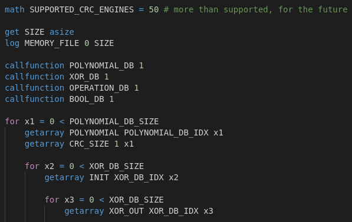

# QuickBMS VSCode Extension
This is a Visual Studio Code extension that provides support for the [QuickBMS scripting language](https://aluigi.altervista.org/quickbms.htm).

* Syntax Highlighting

## Development
This is currently a small hobby project, so any PRs for fixes and improvements are welcome.

## TODO
These are some potential features that could be implemented in the future:

* Make sure all syntax elements are properly highlighted (current implementation is partial)
* Auto-complete indented structures (for loops, function definitions, etc.)
* Provide hover documentation for language statements (ex. `getarray`)
* Provide code linting support (no existing linters as far as I am aware)